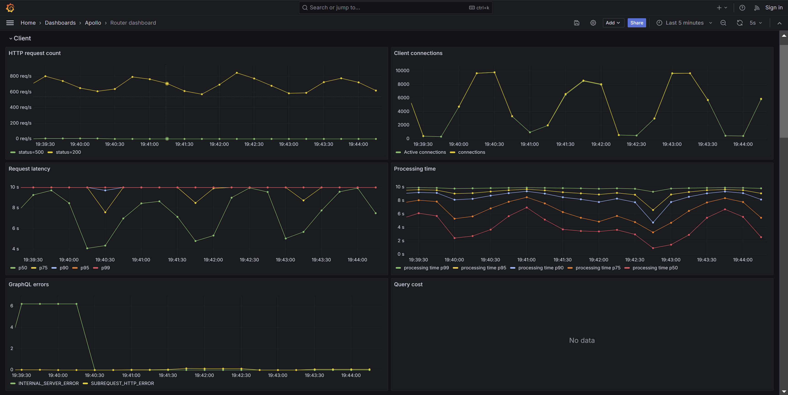
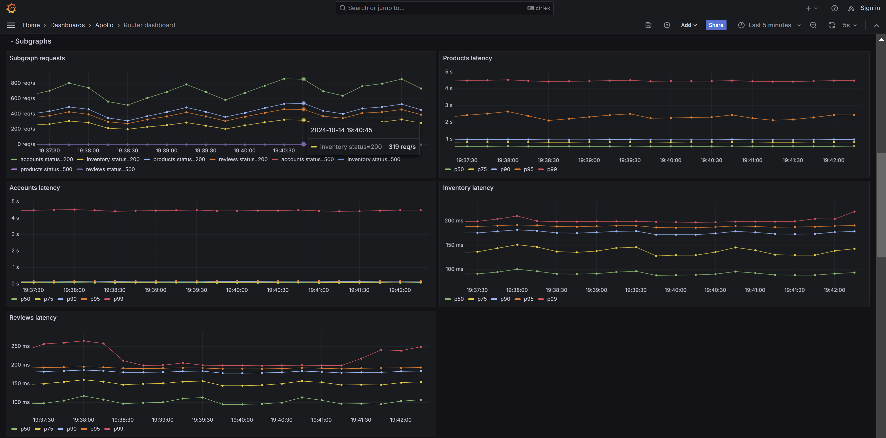
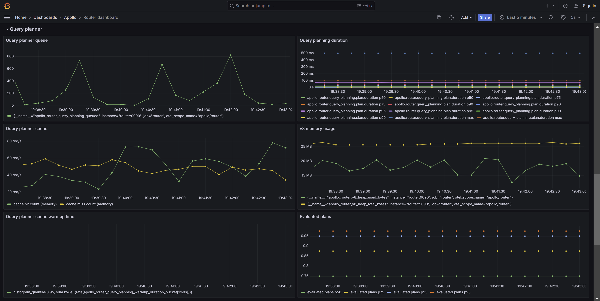
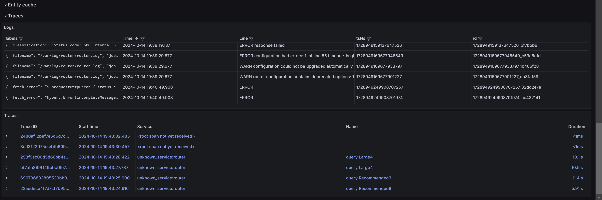

# Performance Tracing Example

## Initial Setup

1. Install Docker.
2. Execute the `docker compose` command

```shell
#Compose and start docker containers
docker compose up -d

##### OTHER DOCKER COMMANDS #####
# Docker container status
docker ps
# Stop all docker containers
docker stop $(docker ps -a -q)
# Remove all container
docker rm $(docker ps -a -q)
```

This workbench provides a simulated observability stack for a supergraph.

You can execute queries against the router and see how things change.

## Important URLs

### Execution

[Apollo sandbox](http://localhost:4000) - Run graphql queries

### Configuration

- Router Configurations: [Router yaml](./router.yaml)
- Supergraph Schema: [Supergraph schema](./supergraph.graphql)

### Observability

- Grafna For Metrics Monitoring: [Metrics and tracing and logs](http://localhost:3000/d/router/router-dashboard?orgId=1)
- Apollo Studio: [studio organization](https://studio.apollographql.com/org/graphql-summit-performance-workshop/invite/2c884896-5157-44e6-89d3-7395a7eb1049)

## Step 1: Data Gathering

- Look for logs when the router is overloaded
- Look at traces indicating what could be happening, especially traces for long requests
- Look for correlations between metrics

## Step 2: Reducing Inbound Traffic

### Step 2.1: Setting Timeout

Putting a hard limit on time spent per request.

```yaml
traffic_shaping:
  router:
    timeout: 100ms
```

### Step 2.2: Rate Limiting

We can see there are still too many requests, even if they don't take too much time (cf little's law)
so we need to reduce the rate.

```yaml
traffic_shaping:
  router:
    timeout: 5s
    global_rate_limit:
      capacity: 500
      interval: 1s
```

## Step 3: Handle the load on the Subgraphs

We have to protect our subgraphs from traffic, so we will apply timeouts and rate limiting over there as well

```yaml
traffic_shaping:
  router:
    timeout: 5s
    global_rate_limit:
      capacity: 500
      interval: 1s
  all:
    timeout: 1s
    global_rate_limit:
     capacity: 400
     interval: 1s
  subgraphs:
    products:
      timeout: 200ms
    accounts:
      global_rate_limit:
         capacity: 200
         interval: 1s

```

### Step 3.1: Check if this help us stabilize the situation?

- Here, we can see that the rate limiting is working, we reject half the traffic, and the latency has reduced at subgraphs

## Step 4: Take a look one subgraph at a time

- We can see that the products subgraph still has some high latency, the reviews subgraphs throws 429 errors.
- Possibly the rate limiting is too strict for reviews?

### Step 4.1: Enable Query Deduplication

```yaml
traffic_shaping:
  router:
    timeout: 5s
    global_rate_limit:
      capacity: 500
      interval: 1s
  all:
    timeout: 1s
    global_rate_limit:
      capacity: 400
      interval: 1s
  subgraphs:
    reviews:
      deduplicate_query: true
```

This brings down the subgraph latency histogram and makes it way more stable, maybe we could activate it on all subgraphs?

```yaml
traffic_shaping:
  router:
    timeout: 5s
    global_rate_limit:
      capacity: 500
      interval: 1s
  all:
    timeout: 1s
    global_rate_limit:
      capacity: 100
      interval: 1s
    products:
      deduplicate_query: true
```

This is bringing down the overall latency for the client request. We can relax the rate limiter now?

### Step 4.2: Try out various rate limit settings

the rate limiter for reviews seems to be triggering but its latency is manageable, so let's relax that one first
it seems we have about 500 rps on reviews

```yaml
traffic_shaping:
  router:
    timeout: 5s
    global_rate_limit:
      capacity: 500
      interval: 1s
  all:
    timeout: 1s
    global_rate_limit:
      capacity: 100
      interval: 1s
      deduplicate_query: true
  subgraphs:
    reviews:
      global_rate_limit:
        capacity: 400
        interval: 1s
```

now let's relax the main rate limiter a bit

first at 700 RPS, then up to 1000 RPS

```yaml
traffic_shaping:
  router:
    timeout: 5s
    global_rate_limit:
      capacity: 1000
      interval: 1s
  all:
    timeout: 1s
    global_rate_limit:
      capacity: 100
      interval: 1s
      deduplicate_query: true
  subgraphs:
    reviews:
      global_rate_limit:
        capacity: 400
        interval: 1s
```

## Step 5: Analyzing the Traces

- We reduced the overall latency, but why are we still seeing a high p90?
- Some queries seem to wait a lot between spans => probably a high CPU consumption issue
- Some seem to spend a lot of time in the query planner

## Step 6: Checking the Overloaded Query Planner

- The cache misses are all over the place
- Check the query planner cache

```yaml
supergraph:
  introspection: true
  listen: 0.0.0.0:4000
  query_planning:
     cache:
      in_memory:
        limit: 100
```

We now see the query planner latency decrease, and p99 request latency decreases

### Step 6.1: Understanding the `query planner warmup`

```yaml
supergraph:
  introspection: true
  listen: 0.0.0.0:4000
  query_planning:
    warmed_up_queries: 5
```

### Step 6.2: Experimenting with various plans limits

```yaml
supergraph:
  introspection: true
  listen: 0.0.0.0:4000
  query_planning:
    experimental_plans_limit: 10
```

what is left now?

## Step 7: Enabling Entity Cache

```yaml
preview_entity_cache:
  enabled: true
  # Configure Redis
  redis:
    urls: ["redis://redis:6379"]
    timeout: 5ms # Optional, by default: 2ms
    ttl: 10s # Optional, by default no expiration

  subgraph:
    product:
      enabled: true
```

## Screenshots of the Router Dashboard

### Client Level Information



### Subgraph Analysis



### Query Planner



### Traces


